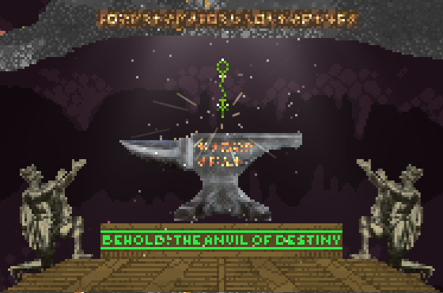

# Anvil of Destiny
A mod for Noita (https://noitagame.com/) which adds an anvil into the default biomes, which lets you forge two wands into a new one!

Currently only works for default wands. Just throw two wands onto the anvil and boom! You get a new wand! The level of the new wand will be 1 higher than the lowest used wand. You can throw wands by opening your inventory and dragging them out into the gameworld. If the anvil doesn't eat up the wand, it's either a not supported wand or you missed the hitbox.

- Level 2 wand + Level 3 wand = Level 3 wand
- Level 3 wand + Level 6 wand = Level 4 wand
- Level 5 wand + Level 5 wand = Level 6 wand

Level 6 is the highest, currently 6 + 6 gets you a new level 6 wand.

